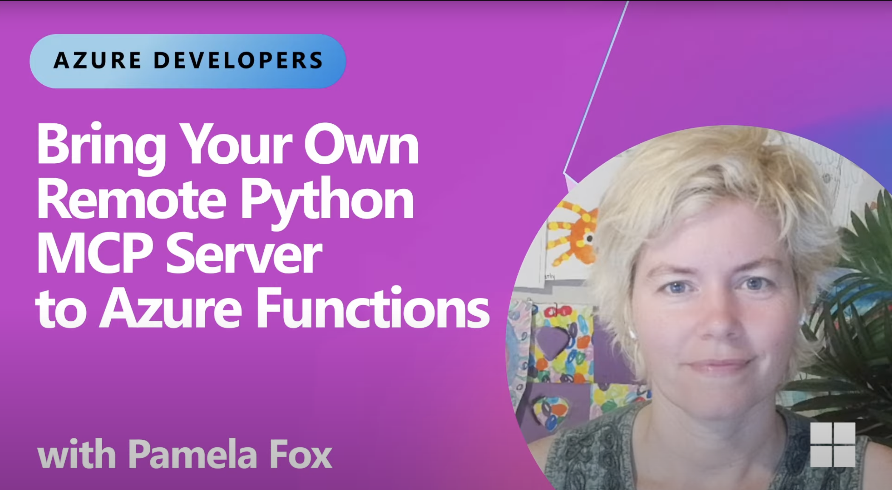
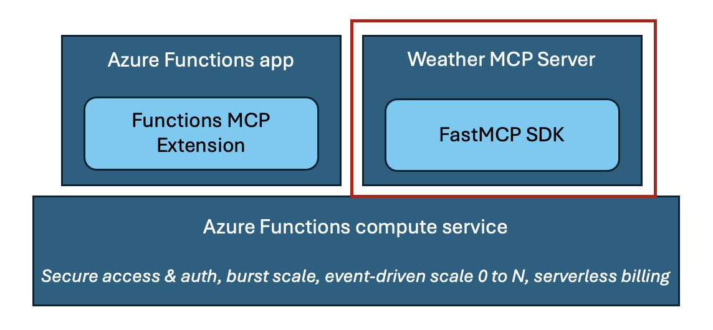
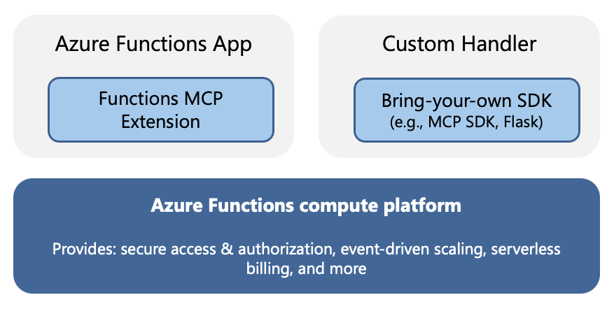
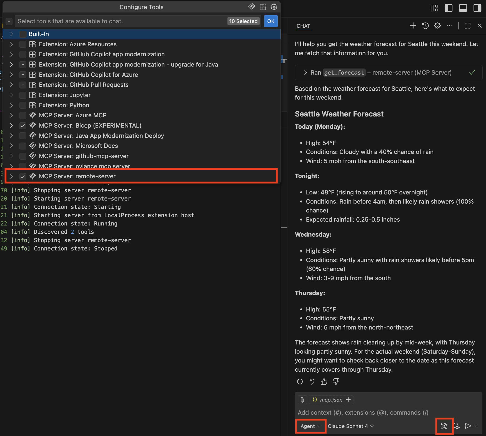
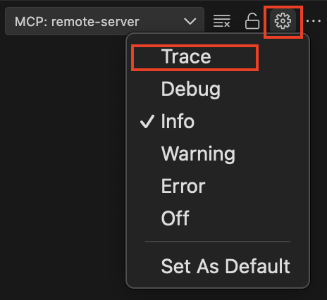
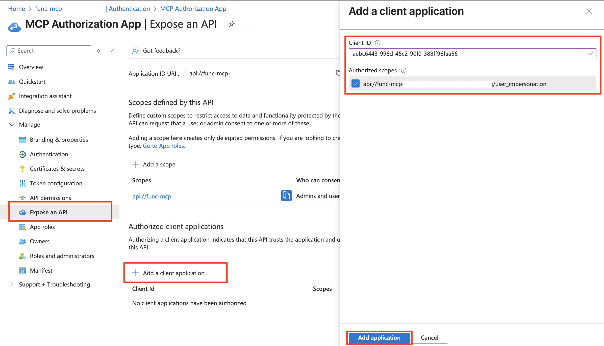

# Host remote MCP servers built with official MCP SDKs on Azure Functions

This repo contains instructions and sample for running MCP server built with the Python MCP SDK on Azure Functions. The repo uses the weather sample server to demonstrate how this can be done. You can clone to run and test the server locally, follow by easy deploy with `azd up` to have it in the cloud in a few minutes.

**Watch the video overview**

<a href="https://www.youtube.com/watch?v=PAxBlQ9mFv8" target="_blank">
  
</a>

## Running MCP server as custom handler on Azure Functions

Recently Azure Functions released the [Functions MCP extension](https://techcommunity.microsoft.com/blog/appsonazureblog/build-ai-agent-tools-using-remote-mcp-with-azure-functions/4401059), allowing developers to build MCP servers using Functions programming model, which is essentially Function's event-driven framework, and host them remotely on the serverless platform.

For those who have already built servers with [Anthropic's MCP SDKs](https://github.com/modelcontextprotocol/servers?tab=readme-ov-file#model-context-protocol-servers), it's also possible to host the servers on Azure Functions by running them as _custom handlers_, which are lightweight web servers that receive events from the Functions host. They allow you to host your already-built MCP servers with no code changes and benefit from Function's bursty scale, serverless pricing model, and security features.

This repo focuses on the second hosting scenario:  

<div align="center">
  
</div>

More generally speaking, you can leverage custom handlers to host apps built with your choice of frameworks and SDKs on Azure Functions:

<div align="center">
  
</div>

## Prerequisites

Ensure you have the following:

* [Azure subscription](../guides/developer/azure-developer-guide.md#understanding-accounts-subscriptions-and-billing) ([create a free one](https://azure.microsoft.com/free/dotnet/))
* [Azure Developer CLI](https://learn.microsoft.com/azure/developer/azure-developer-cli/install-azd)
* [Azure Functions Core Tools](https://learn.microsoft.com/azure/azure-functions/functions-run-local?tabs=windows%2Cisolated-process%2Cnode-v4%2Cpython-v2%2Chttp-trigger%2Ccontainer-apps&pivots=programming-language-typescript)
* [Visual Studio Code](https://code.visualstudio.com/)
* [Azure Functions extension on Visual Studio Code](https://marketplace.visualstudio.com/items?itemName=ms-azuretools.vscode-azurefunctions)

>[!IMPORTANT]
>This sample requires that you have permission to create a [Microsoft Entra app](https://docs.azure.cn/entra/fundamentals/what-is-entra) in the Azure subscription you use. 

## If you already have an existing server... 

Follow these instructions to scaffold your project: 

1. In your MCP project, run `azd init --template mcp-python-scaffold`
1. [TODO]
1. In `host.json`, put the main Python script path as the value of `arguments`. 

Once you're done with the above, continue from the [Run the server locally](#run-the-server-locally) section. 

## If you're starting from scratch...

1. Clone the repo and open the sample in Visual Studio Code

    ```shell
    git clone https://github.com/Azure-Samples/mcp-sdk-functions-hosting-python.git
    ```

## Run the server locally

1. In the root directory, run `uv run func start` to create the virtual environment, install dependencies, and start the server locally
1. Open _mcp.json_ (in the _.vscode_ directory)
1. Start the server by selecting the _Start_ button above the **local-mcp-server**
1. Click on the Copilot icon at the top to open chat (or `Ctrl+Command+I / Ctrl+Alt+I`), and then change to _Agent_ mode in the question window.
1. Click the tools icon and make sure **local-mcp-server** is checked for Copilot to use in the chat:
   
    
1. Once the server displays the number of tools available, ask "What is the weather in NYC?" Copilot should call one of the weather tools to help answer this question.
1. Deactivate the virtual environment

### Register resource provider before deploying

Before deploying, you need to register the `Microsoft.App` resource provider:
```shell
az provider register --namespace 'Microsoft.App'
```

Wait a few seconds for registration to complete. You can check status by using:
```shell
az provider show -n Microsoft.App
```

### Deployment 

1. This sample uses Visual Studio Code as the main client. Configure it as an allowed client application:
    ```shell
    azd env set PRE_AUTHORIZED_CLIENT_IDS aebc6443-996d-45c2-90f0-388ff96faa56
    ```

1. Specify a service management reference if required by your organization. If you're not a Microsoft employee and don't know that you need to set this, you can skip this step. However, if provisioning fails with an error about a missing service management reference, you may need to revisit this step. Microsoft employees using a Microsoft tenant must provide a service management reference (your Service Tree ID). Without this, you won't be able to create the Entra app registration, and provisioning will fail.
    ```shell
    azd env set SERVICE_MANAGEMENT_REFERENCE <service-management-reference>
    ```

1. Run `azd up` in the root directory. This command will create and deploy the app, plus other required resources.

    When the deployment finishes, your terminal will display output similar to the following:

    ```shell
      (✓) Done: Resource group: rg-resource-group-name (12.061s)
      (✓) Done: App Service plan: plan-random-guid (6.748s)
      (✓) Done: Virtual Network: vnet-random-guid (8.566s)
      (✓) Done: Log Analytics workspace: log-random-guid (29.422s)
      (✓) Done: Storage account: strandomguid (34.527s)
      (✓) Done: Application Insights: appi-random-guid (8.625s)
      (✓) Done: Function App: func-mcp-random-guid (36.096s)
      (✓) Done: Private Endpoint: blob-private-endpoint (30.67s)

      Deploying services (azd deploy)
      (✓) Done: Deploying service api
      - Endpoint: https://functionapp-name.azurewebsites.net/
    ```

### Connect to server on Visual Studio Code

1. Open _mcp.json_ in VS Code.
1. Stop the local server by selecting the _Stop_ button above the **local-mcp-server**.
1. Start the remote server by selecting the _Start_ button above the **remote-mcp-server**.
1. VS Code will prompt you for the Function App name. Copy it from either the terminal output or the Portal.
1. Open Copilot in Agent mode and make sure **remote-mcp-server** is checked in the tool's list.
1. VS Code should prompt you to authenticate to Microsoft. Click _Allow_, and then login into your Microsoft account (the one used to access Azure Portal).
1. Ask Copilot "What is the weather in Seattle?". It should call one of the weather tools to help answer.

>[!TIP]
>In addition to starting an MCP server in _mcp.json_, you can see output of a server by clicking _More..._ -> _Show Output_. The output provides useful information like why a connection might've failed.
>
>You can also click the gear icon to change log levels to "Traces" to get even more details on the interactions between the client (VSCode) and the server.
>
>

### Redeployment

If you want to redeploy the server after making changes, there are different options:

1. Run `azd deploy`. (See azd command [reference](https://learn.microsoft.com/azure/developer/azure-developer-cli/reference).)
1. Open command palette in VS Code (`Command+Shift+P/Cntrl+Shift+P`) and search for **Azure Functions: Deploy to Function App**. Then select the name of the function app to deploy to. 

## Built-in server authentication with EasyAuth

The server is configured with EasyAuth, which is an integration with Azure Functions that implements the requirements of the [MCP authorization specification](https://modelcontextprotocol.io/specification/2025-06-18/basic/authorization#authorization-server-discovery). For example, when a client first connects to the MCP server, it'd get a 401 response with header containining the path to Protected Resource Metadata (PRM). The client can use the PRM's information to locate the identity provider, which is Entra in this case. That's why when connecting to the server, you're prompted to authenticate. Once you do, Entra returns an access token to the client, which uses it in a new call to connect to the server. 

### Support for other clients

Agents in Azure AI Foundry can be configured to leverage the remote MCP server. Docs coming soon. 

## Clean up resources

When you're done working with your server, you can use this command to delete the resources created on Azure and avoid incurring any further costs:

  ```shell
  azd down
  ```

## Next steps

### Find this sample in other languages

| Language (Stack) | Repo Location |
|------------------|---------------|
| C# (.NET) | [mcp-sdk-functions-hosting-dotnet](https://github.com/Azure-Samples/mcp-sdk-functions-hosting-dotnet) |
| Node | [mcp-sdk-functions-hosting-node](https://github.com/Azure-Samples/mcp-sdk-functions-hosting-node) |


## Troubleshooting 
The following are some common issues that come up. 

1. **InternalServerError: There was an unexpected InternalServerError. Please try again later.**

    Check if you have registered the `Microsoft.App` resource provider:

    ```shell
    az provider show -n Microsoft.App
    ```

    If it's showing up as unregistered, register it:
    ```shell
    az provider register --namespace 'Microsoft.App'
    ```

    Successful registration should show:
    ```shell
    Namespace      RegistrationPolicy    RegistrationState
    -------------  --------------------  -------------------
    Microsoft.App  RegistrationRequired  Registered
    ```

    Then run `azd up` again. 

2. **Error: error executing step command 'deploy --all': getting target resource: resource not found: unable to find a resource tagged with 'azd-server-name: api'. Ensure the service resource is corrected tagged in your infrastructure configuration, and rerun provision**

    This is a [known transient error](https://github.com/Azure/azure-dev/issues/5580). Try re-running `azd up`. 

3. **Need admin approval. Visual Studio Code needs permission to access resources in your organization that only an admin can grant. Please ask an admin to grant permission to this app before you can use it.**

    This means your Entra app hasn't authorized VS Code as a trusted client. To fix this issue, go to the Azure Portal and search for your Entra app ("MCP Authorization App") in the global search bar. Inside the Entra app resource, click on **Expose an API** in the left menu. Look for the **+ Add a client application** button. Click to add VS Code's Client ID `aebc6443-996d-45c2-90f0-388ff96faa56`, remembering to check the authorized scopes box and click **Add application**:

    

4. **Connection state: Error Error sending message to {endpoint}: TypeError: fetch failed**
    
    - Ensure the Function app domain is correct when connecting to the server.

5. **Ensure you have the latest version of Azure Functions Core Tools installed.**
   
    - You need [version >=4.2.1](https://learn.microsoft.com/azure/azure-functions/functions-run-local?tabs=windows%2Cisolated-process%2Cnode-v4%2Cpython-v2%2Chttp-trigger%2Ccontainer-apps&pivots=programming-language-typescript). Check by running `func --version`.


